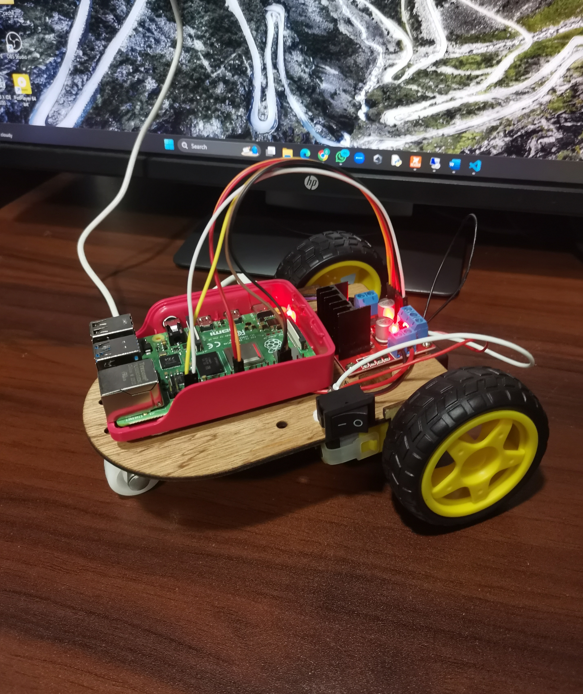

PiCar: Web-Controlled Robot
Welcome to the PiCar project! This is a web-controlled robot powered by a Raspberry Pi. It allows you to control the robot's movement and speed through a simple web interface. Below you'll find an overview of the project and how to set it up.

Features
Web Interface: Control the robot's movement (forward, backward, left, right, stop) using direction buttons.

Speed Control: Adjust the motor speed with a slider.

Real-time Feedback: Changes in direction and speed are applied instantly.

Project Files
remote.php: Web interface for robot control.

ajax_direction.php: Handles direction commands from the interface.

ajax_speed.php: Handles speed adjustment commands.

generate_pwm.py: Python script to control the motors with PWM signals.

pwm_control.py: Manages the PWM updates and ensures instant speed changes.

remote.css: Styles the web interface for a better user experience.

Setup Instructions
Hardware Requirements:
Raspberry Pi (any model with GPIO pins)

Motor driver (e.g., L298N)

Motors and wheels for movement

Power supply for Raspberry Pi and motors

Software Requirements:
Python 3.x

Apache or Nginx (Web Server for PHP)

PHP 7.x or above

GPIO library for Raspberry Pi

Clone the Repository:
bash
Copy
Edit
git clone https://github.com/yourusername/PiCar.git
cd PiCar
Install Dependencies:
Make sure you have PHP and a web server installed:

bash
Copy
Edit
sudo apt-get update
sudo apt-get install apache2 php libapache2-mod-php
sudo apt-get install python3-rpi.gpio
You may also need to enable Apache to handle the PHP scripts:

bash
Copy
Edit
sudo systemctl enable apache2
Run the Web Server:
Make sure the Apache web server is running, then place the files in the server's root directory (e.g., /var/www/html):

bash
Copy
Edit
sudo cp -r * /var/www/html/
Now, navigate to the Pi's IP address from a browser (http://<RaspberryPi_IP>/remote.php) to interact with the web interface.

Control the Robot:
Open the web interface on your browser by navigating to http://<RaspberryPi_IP>/remote.php. From there, you can control the robot's movement and adjust speed.
